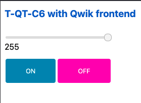
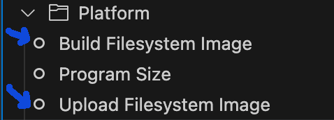

# ESP32 LilyGo T-QT C6 SDK

## Description

This is an Arduino library (v3.x) to use the [LilyGo T-QT C6](https://lilygo.cc/products/t-qt-c6) with touch gesture display and LiPo battery.
<figure>
  
  <figcaption>image from lilygo.cc</figcaption>
</figure>

[LilyGo T-QT C6](https://lilygo.cc/products/t-qt-c6) is a mini development board based on the [ESP32-C6](https://www.espressif.com/en/products/socs/esp32-c6) chip from [espressif](https://www.espressif.com/en) and with a 128x128px TFT full-color touch gesture screen

example code from LilyGo: [T-QT-C6](https://github.com/Xinyuan-LilyGO/T-QT-C6)

## Features

- Wireless: Wi-Fi 6 2.4GHz, Bluetooth 5 (LE), Thread, Zigbee
- CPU 32-bit RISC-V 160 MHz
- CPU 32-bit RISC-V 20 MHz
- 320 KB ROM
- 512 KB SRAM
- supports PSRAM
- protocols: SPI, UART, I2C, RMT, TWAI, PWM, SDIO, Motor Control PWM
- 12-bit ADC
- temperature sensor

## Example codes

Clone this repository.

Uncomment a `src_dir=` line in the `platform.ini` file.

|example|code|description|
|---|---|---|
| Serial | [./examples/serial](./examples/serial) | UART as debug output |
| MAC | [./examples/mac](./examples/mac) | Outputs the MAC address |
| breathing light | [./examples/breathing-light](./examples/breathing-light) | showcase breathing-light |
| task stack size | [./examples/task-stack-size](./examples/taskstack-size) | gather needed stack size |
| dev mode | [./examples/dev-mode](./examples/dev-mode) | QtDev class with all features |
| battery voltage | [./examples/battery-voltage](./examples/battery-voltage) | Outputs the battery voltage |
| touch CST816T | [./examples/touch-CST816T](./examples/touch-CST816T) | touch gesture to Serial |
| gfx | [./examples/gfx](./examples/gfx) | showcase display drawing |
| touch-CST816T-gfx | [./examples/touch-CST816T-gfx](./examples/touch-CST816T-gfx) | display with touch gesture |
| WiFi AP | [./examples/wifi-ap](./examples/wifi-ap) | Access Point with Qwik UI |
|  | [./examples/](./examples/) |  |

### WiFi AP - WiFi Access Point with Qwik UI example



1. modify the [./partitions.csv](./partitions.csv) if needed to prepare the filesystem

2. build and upload the project


3. build and upload Qwik UI (SSG) in `/data`
```sh
cd ui && pnpm i
```
```sh
pnpm build.state
```
4. call
`Build Filesystem Image` then
`Upload Filesystem Image`:




## Disclaimer

Contribution and help ... if you find an issue or wants to contribute then please do not hesitate to create a merge request or an issue.

We provide our build template as is, and we make no promises or guarantees about this code.
